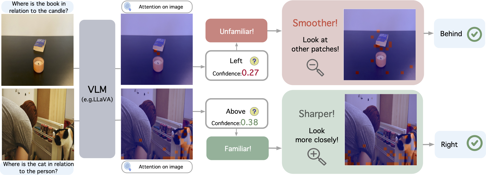

# AdaptVis: Spatial Understanding in Vision-Language Models Requires Adaptive Attention

Code and datasets for "AdaptVis: Spatial Understanding in Vision-Language Models Requires Adaptive Attention".


This code is based on the code of, **What's "up" with vision-language models? Investigating their struggle with spatial reasoning** [[paper](https://arxiv.org/pdf/2310.19785)][[code](https://github.com/amitakamath/whatsup_vlms)].

<p align="center">

</p>


# Datasets
 The code to load and evaluate each dataset in `dataset_zoo/aro_datasets.py`. The Question and Answering data is in `prompt/`

# ScalingVis and AdaptVis

## Setting Up the environment

```
git clone https://github.com/shiqichen17/AdaptVis.git
mkdir data
pip install requirements.txt
```

## Downloading the data
The data all lives in `whatsup_vlms/data`, which is also where your models will go as they're downloaded.   

For all the datasets, setting `--download=True` (while running `python main_aro.py` or while instantiating the dataset directly, as mentioned later in this README) will download the data JSONs and images if the files don't already exist.

You can also download the data directly from [this Google Drive link](https://drive.google.com/drive/u/3/folders/164q6X9hrvP-QYpi3ioSnfMuyHpG5oRkZ).


## Running experiments scaling_vis and adapt_vis
```
bash run.sh
```

# Citation
If you use this code or data, please consider citing our paper:
```
```
